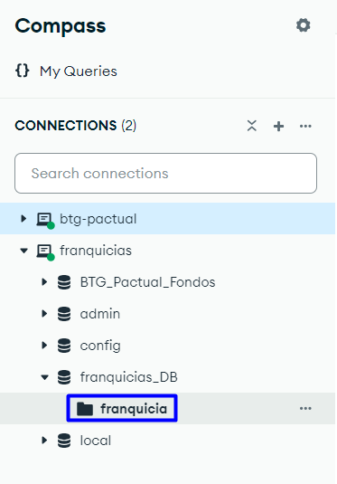
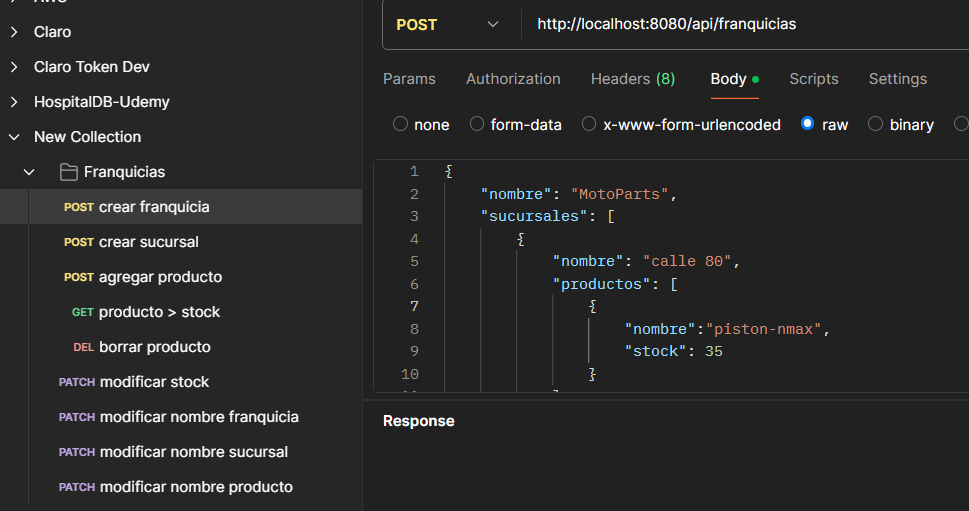

# API de Gestión de Franquicias

Esta es una API RESTful desarrollada en Spring Boot que permite gestionar franquicias y sus respectivas sucursales y productos. La aplicación utiliza MongoDB como sistema de almacenamiento.

## Descripción del Proyecto

Este proyecto gestiona una lista de franquicias y permite realizar las siguientes acciones:

1. Crear y gestionar franquicias.
2. Agregar, actualizar y eliminar sucursales y productos.
3. Consultar el producto con mayor stock por sucursal para una franquicia específica.

### Criterios de Aceptación

1. Crear nuevas franquicias.
2. Agregar sucursales y productos.
3. Modificar stock de productos.
4. Eliminar productos de una sucursal.
5. Consultar el producto con mayor stock en una franquicia específica.
6. Opcional: Actualización de nombres (franquicia, sucursal, producto).

### Estructura de la Aplicación

La API sigue una arquitectura basada en controladores y servicios. La estructura principal incluye:

- **Controladores**: para gestionar las peticiones REST.
- **Servicios**: para la lógica de negocio.
- **Repositorios**: para la interacción con MongoDB.

## Tecnologías Utilizadas

- **Java 17**
- **Spring Boot** (WebFlux para soporte reactivo)
- **MongoDB** (Almacenamiento de datos)
- **Git** (Control de versiones)

## Instalación y Configuración

### Requisitos

- Java 17.
- Maven para construir la aplicación.

### Construcción y Ejecución

1. Clona el repositorio:
   ```bash
   git clone https://github.com/CDanilo23/franquicias-back.git
   cd franquicias-back
2. Compila el proyecto
````
mvn clean package
````
3. Debes tener instalado MongoDB en tu maquina. 
4. Desde Mongo Compas crea una nueva conexion 
````franquicias````
5. Crea la base de datos 
````franquicias_DB````
6. Desde la Base de datos "franquicias_DB" crea la coleccion 
````franquicia````


7. Ejecuta la aplicacion desde el IDE de tu preferecia o con el comando
```` 
mvn spring-boot:run
````
8. Desde postman abre la collecion franquicias.postman_collection que esta en la raiz del proyecto
9. Ejecuta cada request en orden 



## Endpoints

### 1. **Agregar una nueva franquicia**
- **Método**: `POST`
- **URL**: `/franquicias`
- **Cuerpo de solicitud**: Información de la franquicia (nombre y sucursales).

### 2. **Agregar una sucursal a una franquicia**
- **Método**: `POST`
- **URL**: `/franquicias/{nombreFranquicia}/sucursales`
- **Cuerpo de solicitud**: Información de la sucursal (nombre y productos).

### 3. **Agregar un producto a una sucursal**
- **Método**: `POST`
- **URL**: `/franquicias/{nombreFranquicia}/sucursales/{nombreSucursal}/productos`
- **Cuerpo de solicitud**: Información del producto (nombre y stock).

### 4. **Eliminar un producto de una sucursal**
- **Método**: `DELETE`
- **URL**: `/franquicias/{nombreFranquicia}/sucursales/{nombreSucursal}/productos/{nombreProducto}`

### 5. **Modificar el stock de un producto**
- **Método**: `PATCH`
- **URL**: `/franquicias/{nombreFranquicia}/sucursales/{nombreSucursal}/productos/{nombreProducto}/stock`
- **Parámetros**: `nuevoStock`

### 6. **Obtener productos con mayor stock por sucursal**
- **Método**: `GET`
- **URL**: `/franquicias/{nombreFranquicia}/productos-con-mayor-stock`

### 7. **Actualizar el nombre de una franquicia**
- **Método**: `PATCH`
- **URL**: `/franquicias/{nombreFranquicia}/nombre`
- **Parámetros**: `nuevoNombre`

### 8. **Actualizar el nombre de una sucursal**
- **Método**: `PATCH`
- **URL**: `/franquicias/{nombreFranquicia}/sucursales/{idSucursal}/nombre`
- **Parámetros**: `nuevoNombre`

### 9. **Actualizar el nombre de un producto**
- **Método**: `PATCH`
- **URL**: `/franquicias/{nombreFranquicia}/sucursales/{nombreSucursal}/productos/{nombreProducto}/nombre`
- **Parámetros**: `nuevoNombre`

